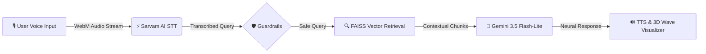

# ⚡ Sarvam-Gemini Voice RAG

<div align="center">

[](https://fastapi.tiangolo.com/)
[](https://ai.google.dev/)
[](https://www.sarvam.ai/)
[](https://github.com/facebookresearch/faiss)
[](https://python.org)

**Real-Time, Ultra-Fast Multi-Lingual Indian Voice Assistant with Holographic 3D Spectrum Dashboard**

</div>

---

## 🌟 Overview

**Sarvam-Gemini Voice RAG** is a next-generation voice-based Retrieval-Augmented Generation (RAG) system engineered for low-latency voice interactions across Indian languages (**Hindi**, **English**, **Hinglish**, **Tamil**, **Bengali**, etc.). 

Combining **Sarvam AI Saaras v4 STT** with **Google Gemini 3.5 Flash-Lite** and **FAISS Vector Search**, the system delivers end-to-end voice-to-voice RAG in **~1.0 - 1.5 seconds**.

---

## 🚀 Key Features

- **🎙️ Indic Voice Recognition (Sarvam AI Saaras v4)**: High-accuracy real-time speech transcription tailored for Indian accents and regional languages.
- **⚡ Sub-Second Neural Generation (Gemini 3.5 Flash-Lite)**: Ultra-low latency responses with contextual Indian knowledge retrieval.
- **🔍 FAISS Semantic Vector Index**: Fast dense retrieval over curated knowledge bases with semantic fallback.
- **🔮 Holographic 3D Audio Visualizer**: Real-time Web Audio API-powered dynamic frequency spectrum that reacts live to speech, thinking states, and synthetic speech output.
- **📊 Real-Time Pipeline HUD**: Live telemetry tracking latency across STT, Retrieval, and Generation.
- **🔊 Auto Speech Synthesis (TTS)**: Native browser TTS with automatic accent and language detection.
- **🛡️ Input Safety & Guardrails**: Integrated content moderation filters.

---

## 🏗️ Architecture & Pipeline Flow



---

## ⚡ Latency Benchmarks

| Component | Average Latency |
| :--- | :--- |
| **Sarvam STT (Saaras v4)** | ~1.0s – 1.2s |
| **Vector Retrieval (FAISS)** | < 15ms |
| **Gemini 3.5 Flash-Lite** | ~600ms – 900ms |
| **Total End-to-End Latency** | **~1.2s – 1.5s** |

---

## 🛠️ Quickstart Installation

### 1. Clone the Repository
```bash
git clone https://github.com/vijaymul/sarvam-gemini-voicerag.git
cd sarvam-gemini-voicerag
```

### 2. Set Up Virtual Environment & Dependencies
```bash
# Create virtual environment
python -m venv venv2

# Activate virtual environment
# Windows:
.\venv2\Scripts\activate
# Linux/macOS:
source venv2/bin/activate

# Install requirements
pip install -r requirements.txt
```

### 3. Configure Environment Variables
Create a `.env` file in the root directory:
```env
SARVAM_API_KEY=your_sarvam_api_key_here
GEMINI_API_KEY=your_gemini_api_key_here
```

### 4. Run the Application
```bash
uvicorn backend.app:app --reload --port 8000
```
Open your browser and navigate to: **`http://127.0.0.1:8000`**

---

## 🧪 Testing & Verification

### Run End-to-End Integration Tests
```bash
python test_app_integration.py
```

### Run Latency & P50/P70/P100 Benchmarks
```bash
python test_latency.py
```

---

## 📁 Repository Structure

```
├── api/
│   └── index.py               # Vercel serverless entry point
├── backend/
│   ├── app.py                 # FastAPI application routes
│   ├── generation.py          # Gemini 3.5 generation engine
│   ├── guardrails.py          # Input validation & safety
│   ├── ingestion.py           # Dataset indexing & embedding
│   ├── retrieval.py           # FAISS semantic vector search
│   └── stt.py                 # Sarvam AI speech-to-text integration
├── frontend/
│   ├── index.html             # Holographic 3D Cyber UI
│   └── script.js              # Web Audio spectrum engine & HUD
├── .env.example               # Environment variables template
├── .gitignore                 # Protected files configuration
├── requirements.txt           # Python dependencies
├── test_app_integration.py    # Integration test suite
├── test_latency.py            # Latency benchmark suite
├── vercel.json                # Vercel deployment config
└── README.md                  # Project documentation
```

---

## 📜 License

This project is open-source and available under the [MIT License](LICENSE).
